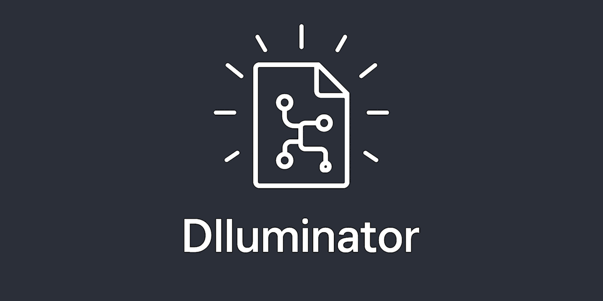

#   
[](https://discord.gg/tPWjMwK) [](https://bsky.app/profile/tinybiggames.com)  

<div align="center">

### Load Win64 DLLs straight from memory 💻🔄

</div>

### Overview 📝

The **Dlluminator** unit provides advanced functionality for loading dynamic-link libraries (DLLs) directly from memory in Win64 environments. Unlike traditional methods that involve loading DLLs from the file system, **Dlluminator** allows you to load DLLs from byte arrays 📂 or memory streams 💾, retrieve function addresses, and unload them—all in-memory. This library is ideal for Delphi/FreePascal developers who need to manage DLLs without relying on the filesystem, enhancing both performance ⚡ and security 🔒.

### Features ✨

- **LoadLibrary**: Loads a DLL from a memory buffer without writing to the disk 💽.
- **FreeLibrary**: Unloads the DLL from memory, ensuring all associated resources are properly released 🔄.
- **GetProcAddress**: Retrieves the address of an exported function within the loaded DLL, enabling direct function calls 📞.
- **Comprehensive Error Handling**: Manages issues such as invalid DLL data 🚫, memory allocation failures 🚨, and function resolution issues 🔧.

### Key Benefits 🌟

- **Increased Security 🔒**: By eliminating the need to store DLLs on disk, **Dlluminator** reduces the risk of DLL hijacking and unauthorized access.
- **Performance Improvement ⚡**: Since DLLs are handled in-memory, the overhead of disk I/O operations is avoided, resulting in faster execution 🚀.
- **Flexibility 🤹**: Suitable for embedding DLLs in the main executable, loading encrypted 🔐 or obfuscated DLLs, and supporting dynamic plugin systems where plugins are provided as in-memory modules.
- **Compatibility 🤝**: The `Dlluminator` unit is compatible with standard DLL interfaces, allowing for easy integration with existing applications. The in-memory redirection method also reduces security risks, such as code injection 💉, offering a secure alternative for DLL management.

### Usage Scenarios 🎯

#### Embedding DLLs 📦

- Embed DLLs directly within your executable. **Dlluminator** allows you to store DLLs as resources, static byte arrays or encrypted data and load them into memory at runtime, removing the need to distribute them as separate files.

#### Encrypted DLL Loading 🔐

- Enhance application security by storing DLLs in an encrypted form, which can then be decrypted into memory before loading with **Dlluminator**. This reduces the risk of reverse engineering.

#### Dynamic Plugin Systems 🔌

- Load plugins dynamically as in-memory DLLs. This approach provides a clean and secure method of extending application functionality without relying on the filesystem.

### Public Functions 📖

#### LoadLibrary 📜

Loads a module from a memory image, mimicking the behavior of the Windows API `LoadLibrary` function. It parses the PE format, performs necessary relocations, resolves imports, and initializes the module.

- **Parameters**: `Data: Pointer` – A pointer to the memory image conforming to the PE format.
- **Parameters**: `Size: NativeUInt` - The size, in bytes, of the DLL binary data stored in the memory block.
- **Returns**: `THandle` representing the loaded module or `0` on failure.

### Installation 🛠️

To successfully integrate **Dlluminator** into your project, please follow these steps:

1. **Download the Latest Version 📥**
   - Visit the official **Dlluminator** repository and download the <a href="https://github.com/tinyBigGAMES/Dlluminator/archive/refs/heads/main.zip" target="_blank">latest release</a>.

2. **Unzip the Package 📂**
   - Once the download is complete, extract the contents of the zip file to a convenient location on your device's filesystem. The extracted folder should contain the Dlluminator source code, documentation, and any necessary dependencies.

3. **Add Dlluminator to Your Project ➕**
   - Add **Dlluminator** to your project's `uses` section. This inclusion will make the **Dlluminator** unit available for use in your application. Ensure that the path to the **Dlluminator** source file is correctly configured in your project settings to avoid compilation errors.

4. **Seamless Integration with Windows API Compatibility 🔄**
   - The **Dlluminator** unit allows for easy integration by providing `LoadLibrary` to load DLLs directly from memory. Once loaded, standard Windows API calls such as `FreeLibrary` and `GetProcAddress` can be used to manage the in-memory DLL as if it were loaded from the filesystem. This design ensures minimal changes to existing code, maintaining compatibility with Windows API conventions while enabling efficient in-memory DLL handling.
   
5. **Test the Integration ✅**
   - It is recommended to thoroughly test your project after integrating **Dlluminator** to ensure that all DLLs are being correctly loaded, utilized, and unloaded from memory. Given the in-memory nature of this library, testing will help identify any potential issues related to memory management or function resolution.
   - Created/tested with Delphi 12.3, on Windows 11, 64-bit (version 24H2)

### 📖 Example Usage

To instantiate **Dlluminator**, include the following code at the end of the unit’s implementation section. This code attempts to load the DLL as an embedded resource: 

```delphi    

uses
  Windows,
  Dlluminator;  
 
...

implementation

{
  This code is an example of using Dlluminator to load an embedded a DLL directly
  from an embedded resource in memory, ensuring that no filesystem access is
  required. It includes methods for loading, initializing, and unloading the
  DLL. The DLL is loaded from a resource with a GUID name, providing a measure
  of security by obfuscating the resource’s identity.

  Variables:
    - DLLHandle: THandle
        - A handle to the loaded DLL. Initialized to 0, indicating the DLL has
          not been loaded. It is updated with the handle returned from
          LoadLibrary when the DLL is successfullyloaded from memory.

  Functions:
    - LoadDLL: Boolean
        - Loads the DLL from an embedded resource and initializes it by
          retrieving necessary exported functions. Returns True if the DLL is
          loaded successfully, otherwise False.

    - b6eb28fd6ebe48359ef93aef774b78d1: string
        - A GUID-named helper function that returns the resource name for the DLL.
          This GUID-like name helps avoid easy detection of the resource.

    - UnloadDLL: procedure
        - Unloads the DLL by freeing the library associated with DLLHandle. Resets
          DLLHandle to 0 to indicate the DLL is unloaded.

  Initialization:
    - The LoadDLL function is called during initialization, and the program will
      terminate with code 1 if the DLL fails to load.

  Finalization:
    - The UnloadDLL procedure is called upon finalization, ensuring the DLL is
      unloaded before program termination.

}

var
  DLLHandle: THandle = 0; // Global handle to the loaded DLL, 0 when not loaded.

{
  LoadDLL
  --------
  Attempts to load a DLL directly from a resource embedded within the executable
  file. This DLL is expected to be stored as an RCDATA resource under a specific
  GUID-like name.

  Returns:
    Boolean - True if the DLL is successfully loaded, False otherwise.
}
function LoadDLL(): Boolean;
var
  LResStream: TResourceStream; // Stream to access the DLL data stored in the
  resource.

  {
    b6eb28fd6ebe48359ef93aef774b78d1
    ---------------------------------
    Returns the name of the embedded DLL resource. Uses a GUID-like name for
    obfuscation.

    Returns:
      string - The name of the resource containing the DLL data.
  }
  function b6eb28fd6ebe48359ef93aef774b78d1(): string;
  const
    // GUID-like resource name for the embedded DLL.
    CValue = 'b87deef5bbfd43c3a07379e26f4dec9b'; 
  begin
    Result := CValue;
  end;

begin
  Result := False;

  // Check if the DLL is already loaded.
  if DLLHandle <> 0 then Exit;

  // Ensure the DLL resource exists.
  if not Boolean((FindResource(HInstance,
    PChar(b6eb28fd6ebe48359ef93aef774b78d1()), RT_RCDATA) <> 0)) then Exit;

  // Create a stream for the DLL resource data.
  LResStream := TResourceStream.Create(HInstance,
    b6eb28fd6ebe48359ef93aef774b78d1(), RT_RCDATA);

  try
    // Attempt to load the DLL from the resource stream.
    DLLHandle := Dlluminator.LoadLibrary(LResStream.Memory, LResStream.Size;
    if DLLHandle = 0 then Exit; // Loading failed.

    // Retrieve and initialize any necessary function exports from the DLL.
    GetExports(DLLHandle);

    Result := True; // Successful load and initialization.
  finally
    LResStream.Free(); // Release the resource stream.
  end;
end;

{
  UnloadDLL
  ---------
  Frees the loaded DLL, releasing any resources associated with DLLHandle,
  and resets DLLHandle to 0.
}
procedure UnloadDLL();
begin
  if DLLHandle <> 0 then
  begin
    FreeLibrary(DLLHandle); // Unload the DLL.
    DLLHandle := 0; // Reset DLLHandle to indicate the DLL is no longer loaded.
  end;
end;

initialization
  // Attempt to load the DLL upon program startup. Halt execution with error
  // code 1 if it fails.
  if not LoadDLL() then
  begin
    Halt(1);
  end;

finalization
  // Ensure the DLL is unloaded upon program termination.
  UnloadDLL();

```

### Acknowledgments 🙏

This project was inspired by:
  * perfect-loader - https://github.com/EvanMcBroom/perfect-loader
 
## 💬 Support & Resources

- 🐞 **Report Issues:** [GitHub Issue Tracker](https://github.com/tinyBigGAMES/Dlluminator/issues)  
- 💬 **Join the Community:** [Forum](https://github.com/tinyBigGAMES/Dlluminator/discussions) | [Discord](https://discord.gg/tPWjMwK)  
- 📚 **Learn Delphi:** [Learn Delphi](https://learndelphi.org)  

## 🤝 Contributing

We welcome contributions to **Dlluminator**! 🚀  

### 💡 Ways to Contribute:
- 🐛 **Report Bugs** – Help improve `Dlluminator` by submitting issues.  
- ✨ **Suggest Features** – Share ideas to enhance its functionality.  
- 🔧 **Submit Pull Requests** – Improve the codebase and add features.  

### 🏆 Contributors

<a href="https://github.com/tinyBigGAMES/Dlluminator/graphs/contributors">
  
</a>

## 📜 License

**Dlluminator** is distributed under the **BSD-3-Clause License**, allowing redistribution and modification in both source and binary forms. 
See the [LICENSE](https://github.com/tinyBigGAMES/Dlluminator?tab=BSD-3-Clause-1-ov-file#BSD-3-Clause-1-ov-file) for details.

## 💖 Support & Sponsorship

Your support keeps **Dlluminator** evolving! If you find this library useful, please consider [sponsoring the project](https://github.com/sponsors/tinyBigGAMES). Every contribution helps drive future enhancements and innovations.

### Other ways to support:
- ⭐ **Star the repo** – Show your appreciation.  
- 📢 **Share with your network** – Spread the word.  
- 🐛 **Report bugs** – Help improve `Dlluminator`.  
- 🔧 **Submit fixes** – Contribute by fixing issues.  
- 💡 **Suggest features** – Help shape its future.  

🚀 Every contribution makes a difference – thank you for being part of the journey!  
  
---

🔥 *Load Win64 DLLs straight from memory — no disk, no traces, no limits*

<p align="center">
  
</p>
<h5 align="center">Made with ❤️ in Delphi</h5>
 
