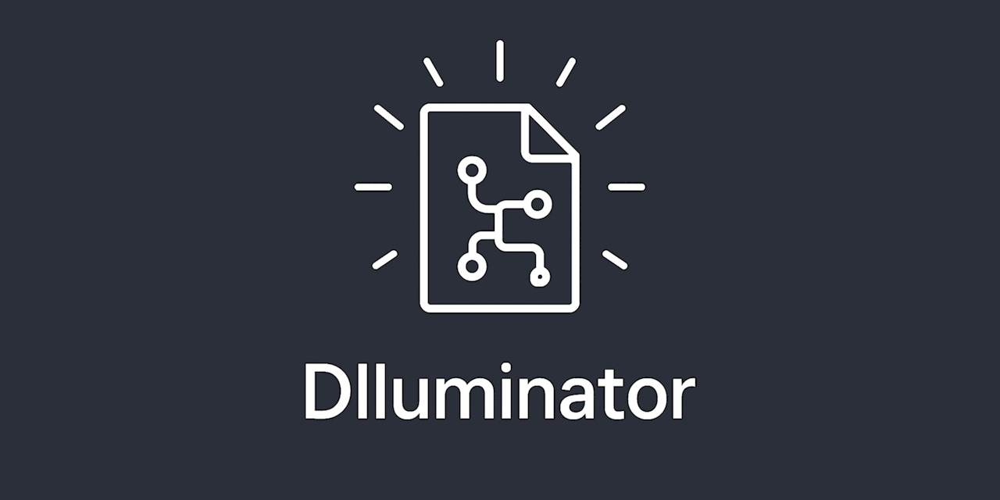

[](https://discord.gg/Wb6z8Wam7p) [](https://bsky.app/profile/tinybiggames.com)

### Load Win64 DLLs straight from memory. Generate Delphi imports from C headers. 💻

### Overview

**Dlluminator** is a Delphi library that loads Win64 DLLs directly from memory and generates Delphi import units from C headers. It eliminates filesystem dependencies for DLL loading and automates the creation of Delphi bindings for C libraries.

The memory loader maps DLLs from byte arrays, embedded resources, or memory streams into the process address space. Standard WinAPI calls (`GetProcAddress`, `FreeLibrary`) work as normal after loading. Multiple DLLs that depend on each other can be loaded from memory together, with Dlluminator resolving the dependency chain automatically.

The **CImporter** tool takes C header files, preprocesses them with tinycc, parses the result, and generates complete Delphi import units (`.pas`) with all types, constants, and function declarations. By default it produces `.rc` and `.RES` files that embed the DLL binary as an `RT_RCDATA` resource and loads it via Dlluminator at startup. CImporter also supports alternative **binding modes**: traditional `external` linking, delayed loading, manual handle binding, and [Virtuoso](https://github.com/tinyBigGAMES/Virtuoso) VPK archive loading. The generated units can be used with or without a Dlluminator dependency.

### Getting Started

**Download a release** from the [Releases](https://github.com/tinyBigGAMES/Dlluminator/releases) page. The release includes the tinycc compiler and supporting files required by CImporter. Cloning the repo alone is not sufficient for CImporter functionality since the tinycc binaries are not checked into version control.

After downloading:

1. Extract the archive to a convenient location.
2. Add the `src` folder to your Delphi project search path.
3. Add `Dlluminator` to your `uses` clause for memory loading.
4. Add `Dlluminator.CImporter` (plus `Dlluminator.Utils`, `Dlluminator.Config`, `Dlluminator.TOML`) for C header import generation.
5. For CImporter, ensure the `tinycc` folder (containing `tcc.exe`, `libtcc.dll`, and `include/`) is accessible relative to your project.

Created and tested with **Delphi 12.3** on **Windows 11 64-bit (version 24H2)**.

### Features

**Memory DLL Loading**

- **LoadLibrary (basic)** loads a DLL from a raw memory buffer. Returns a standard `HMODULE` compatible with `GetProcAddress` and `FreeLibrary`.
- **LoadLibrary (named)** loads a DLL from memory and registers it under a module name so other memory-loaded DLLs can import from it.
- **RegisterDllData (pointer)** registers raw DLL bytes for deferred loading. Nothing is loaded until you call `LoadLibrary(name)` or `LoadAll`.
- **RegisterDllData (resource)** registers a DLL by `RT_RCDATA` resource name. The resource is read on demand during loading, then freed immediately.
- **LoadLibrary (by name)** loads a registered DLL by name, automatically resolving all registered dependencies first via depth-first topological sorting.
- **LoadAll** loads every registered DLL in the correct dependency order with a single call.
- **Circular dependency detection** catches and reports dependency cycles via `ERROR_CIRCULAR_DEPENDENCY`.
- **Windows 11 24H2+ compatible** using `LdrGetDllHandle` and `LdrLoadDll` hooks for robust module lookup on builds where internal loader structures changed.

**CImporter: C Header to Delphi Import Generator**

- Preprocesses C headers using the bundled tinycc compiler (macro expansion, includes).
- Parses the preprocessed output into structs, enums, unions, typedefs, function declarations, and `#define` constants.
- Generates a complete Delphi unit (`.pas`) with T-prefixed record types, P-prefixed pointer types, Cardinal-based enums with const groups, and typed function pointer variables.
- Generates a `.rc` resource script and compiles it to `.RES` via `brcc32`, embedding the DLL binary as `RT_RCDATA` with an obfuscated GUID resource name.
- The generated unit's `initialization` section calls `RegisterDllData` + `LoadAll` to load the DLL from the embedded resource at program startup and bind all exports via `GetProcAddress`.
- The `finalization` section nils all function pointers and calls `FreeLibrary`.
- Supports cross-unit dependencies (e.g. `sdl3_image.pas` adds `sdl3` to its `uses` clause via `AddUsesUnit`).
- Supports function renaming (`AddFunctionRename`) for Delphi keyword conflicts.
- Supports type exclusion (`AddExcludedType`) for skipping unwanted C types.
- Supports file content insertion (`InsertFileBefore`) for injecting additional Delphi code.
- Configuration can be saved to and loaded from TOML files for reproducible builds.
- **Configurable binding modes** control how the generated unit loads the DLL:

| Mode | TOML value | Generated output | Dlluminator dependency |
|---|---|---|---|
| **Static** (default) | `"static"` | Embeds DLL as RCDATA, loads via Dlluminator at startup | Yes |
| **Dynamic** | `"dynamic"` | Standard `external` declarations, DLL resolved by Windows loader | No |
| **Dynamic Delayed** | `"dynamic_delayed"` | `external ... delayed` declarations, DLL loaded on first call | No |
| **Dynamic Custom** | `"dynamic_custom"` | Exports `DlmBindExports(AHandle)` / `DlmUnbindExports` for manual handle management | No |
| **Static VPK** | `"static_vpk"` | Exports `DlmBindExports(AVFS, AFilename)` / `DlmUnbindExports` for loading from Virtuoso VPK archives | Yes |

### How Dependency Resolution Works

A common problem with memory-loaded DLLs is that the Windows loader cannot resolve imports between them. If `sdl3_image.dll` imports functions from `sdl3.dll`, and both are loaded from memory, the loader has no way to find `sdl3.dll` by name because it was never loaded from disk.

Dlluminator solves this in three steps:

1. **Registration.** You call `RegisterDllData` for each DLL, associating a module name (e.g. `'sdl3.dll'`, `'sdl3_image.dll'`) with its raw bytes or an embedded resource. Order does not matter.

2. **Import table parsing.** When `LoadAll` (or `LoadLibrary(name)`) is called, Dlluminator reads the raw PE import table of each DLL to discover its dependencies. It converts import directory RVAs to file offsets to read the data from unmapped PE bytes, so no prior loading is needed.

3. **Depth-first topological loading.** For each DLL, Dlluminator recursively loads its dependencies before loading the DLL itself. Each module is loaded with `DONT_RESOLVE_DLL_REFERENCES` (so the Windows loader maps and relocates it but does not resolve imports), then Dlluminator walks the IAT manually. For each imported function, it checks the internal module registry first (for memory-loaded DLLs) and falls back to `GetModuleHandle`/`LoadLibrary` for system DLLs. After all imports are resolved, the DLL's entry point is called.

The result is that `sdl3_image.dll` can call functions in `sdl3.dll` even though both were loaded entirely from memory, and you never had to think about loading order.

On **Windows 11 24H2+**, the internal loader changed its module lookup structures. Simply patching `BaseDllName` in the LDR entry is no longer sufficient. Dlluminator handles this by installing persistent hooks on `LdrGetDllHandle` and `LdrLoadDll` in ntdll. When the loader cannot find a module by its internal lookup, the hooks check Dlluminator's module registry and return the correct handle.

### Project Structure

```
repo/
  src/                        Delphi source units
    Dlluminator.pas             Core memory DLL loader
    Dlluminator.CImporter.pas   C header to Delphi converter
    Dlluminator.Config.pas      TOML-based configuration for CImporter
    Dlluminator.TOML.pas        TOML parser
    Dlluminator.Utils.pas       Shared utilities
    Dlluminator.Defines.inc     Compiler defines
  tinycc/                     tinycc compiler (from release download)
    tcc.exe                     C compiler/preprocessor
    libtcc.dll                  tinycc shared library
    include/                    C standard headers + Windows SDK headers
  libs/                       C library packages for CImporter
    raylib/                     raylib headers, DLL, and TOML config
    sdl3/                       SDL3 headers, DLL, and TOML config
    sdl3_image/                 SDL3_image headers, DLL, and TOML config
    sdl3_mixer/                 SDL3_mixer headers, DLL, and TOML config
  imports/                    Generated Delphi import units + .rc/.RES files
    raylib.pas                  Generated raylib bindings
    sdl3.pas                    Generated SDL3 bindings
    sdl3_image.pas              Generated SDL3_image bindings
    sdl3_mixer.pas              Generated SDL3_mixer bindings
  examples/
    ImportLibs/                 Example: generate imports from C headers
    TestImports/                Example: use generated imports with Dlluminator
  bin/                        Built executables
```

### Example: CImporter Usage

Generate Delphi bindings for raylib from its C header:

```delphi
uses
  Dlluminator.CImporter;

var
  LImporter: TDlmCImporter;
begin
  LImporter := TDlmCImporter.Create();
  try
    LImporter.SetModuleName('raylib');
    LImporter.SetDllName('raylib');
    LImporter.SetOutputPath('..\imports');
    LImporter.SetDllPath('..\libs\raylib\bin\raylib.dll');
    LImporter.AddIncludePath('..\libs\raylib\include');
    LImporter.AddSourcePath('..\libs\raylib\include');
    LImporter.AddExcludedType('va_list');
    LImporter.SetHeader('..\libs\raylib\include\raylib.h');

    // Save config for reproducible builds
    LImporter.SaveToConfig('..\libs\raylib\raylib.toml');

    if LImporter.Process() then
      WriteLn('Success')
    else
      WriteLn('Failed: ', LImporter.GetLastError());
  finally
    LImporter.Free();
  end;
end;
```

This produces `raylib.pas` (the Delphi import unit), `raylib.rc` (resource script), and `raylib.RES` (compiled resource embedding the DLL). Add `raylib.pas` to your project, link the `.RES`, and call raylib functions directly from Delphi. The DLL loads from the embedded resource at program startup.

For libraries with dependencies, use `AddUsesUnit` to reference an already-generated unit:

```delphi
// sdl3_image depends on sdl3 , tell CImporter about it
LImporter.SetModuleName('sdl3_image');
LImporter.SetDllName('sdl3_image');
LImporter.AddIncludePath('..\libs\sdl3\include', 'sdl3');
LImporter.AddUsesUnit('sdl3'); LImporter.SetHeader('..\\libs\\sdl3_image\\include\\SDL3\\SDL_image.h'); LImporter.Process();

```

The generated `sdl3_image.pas` will include `sdl3` in its `uses` clause and register both DLLs for dependency-aware loading.

To generate a traditional `external`-linked unit instead of an embedded-resource unit, set the binding mode:

```delphi
LImporter.SetModuleName('raylib');
LImporter.SetDllName('raylib');
LImporter.SetOutputPath('..\imports');
LImporter.AddIncludePath('..\libs\raylib\include');
LImporter.AddSourcePath('..\libs\raylib\include');
LImporter.SetBindingMode(bmDynamic);  // Standard external linking, no Dlluminator dependency
LImporter.SetHeader('..\libs\raylib\include\raylib.h');
LImporter.Process();
```
The generated unit uses `external CDllName` declarations instead of function pointer variables. No `.rc`/`.RES` files are produced. The DLL must be available to the Windows loader at runtime. The same setting can be specified in TOML with `binding_mode = "dynamic"`.

Available binding modes for `SetBindingMode`:

- `bmStatic` (default) - DLL embedded as RCDATA, loaded at startup via Dlluminator
- `bmDynamic` - standard `external` declarations, DLL on disk
- `bmDynamicDelayed` - delayed `external` declarations, DLL loaded on first call
- `bmDynamicCustom` - call `DlmBindExports(AHandle)` with your own handle
- `bmStaticVpk` - call `DlmBindExports(AVFS, AFilename)` to load from a Virtuoso VPK archive

### Example: Using Generated Imports

Once the import units are generated, using them is straightforward. The DLLs load from embedded resources automatically:
```
```delphi
uses
  raylib;  // Generated by CImporter , DLL loads at startup

begin
  InitWindow(800, 450, 'Dlluminator - Raylib');
  SetTargetFPS(60);
  while not WindowShouldClose() do
  begin
    BeginDrawing();
      ClearBackground(RAYWHITE);
      DrawText('Hello from Dlluminator!', 280, 200, 20, DARKGREEN);
    EndDrawing();
  end;
  CloseWindow();
end;
```

SDL3 with SDL3_image (cross-DLL dependency, both loaded from memory):

```delphi
uses
  sdl3,        // Loaded first (dependency)
  sdl3_image;  // Loaded second, imports from sdl3

var
  LWindow: PSDL_Window;
  LRenderer: PSDL_Renderer;
  LTexture: PSDL_Texture;
begin
  SDL_Init(SDL_INIT_VIDEO);
  LWindow := SDL_CreateWindow('SDL3 + SDL3_image', 1280, 720, 0);
  LRenderer := SDL_CreateRenderer(LWindow, nil);

  // SDL3_image calls SDL3 functions internally , this just works
  LTexture := IMG_LoadTexture(LRenderer, 'image.png');

  // ... render loop ...

  SDL_DestroyTexture(LTexture);
  SDL_DestroyRenderer(LRenderer);
  SDL_DestroyWindow(LWindow);
  SDL_Quit();
end;
```

### Example: Manual Memory Loading (Without CImporter)

Load a single DLL from an embedded resource:

```delphi
uses
  WinApi.Windows,
  Dlluminator;

var
  LDllHandle: THandle;
  LResStream: TResourceStream;
begin
  LResStream := TResourceStream.Create(HInstance, 'MyDllResource', RT_RCDATA);
  try
    LDllHandle := Dlluminator.LoadLibrary(LResStream.Memory, LResStream.Size);
    if LDllHandle <> 0 then
    try
      MyFunc := GetProcAddress(LDllHandle, 'MyFunction');
    finally
      FreeLibrary(LDllHandle);
    end;
  finally
    LResStream.Free();
  end;
end;
```

### Example: Multiple DLLs with Auto-Dependency Resolution

Register DLLs from embedded resources in any order, then load everything with a single call:

```delphi
uses
  WinApi.Windows,
  Dlluminator;

var
  LDllBHandle: THandle;
begin
  // Register DLLs , order does not matter
  RegisterDllData('DllB.dll', 'f8e7d6c5b4a3219087654321fedcba98');
  RegisterDllData('DllA.dll', 'a1b2c3d4e5f6478890abcdef12345678');

  // Load everything , DllA loads first (dependency), then DllB
  if LoadAll() then
  begin
    LDllBHandle := LoadLibrary('DllB.dll');
    GetCombinedValue := GetProcAddress(LDllBHandle, 'GetCombinedValue');
  end;
end;
```

### Public API Reference

**Dlluminator unit**

| Function | Description |
|---|---|
| `LoadLibrary(AData, ASize)` | Load a DLL from a memory buffer. Returns `HMODULE` or `0`. |
| `LoadLibrary(AData, ASize, AModuleName)` | Load from memory and register under a name for cross-DLL imports. |
| `RegisterDllData(AModuleName, AData, ASize)` | Register raw DLL bytes for deferred loading. |
| `RegisterDllData(AModuleName, AResName)` | Register an `RT_RCDATA` resource for deferred loading. |
| `LoadLibrary(AModuleName)` | Load a registered DLL by name with automatic dependency resolution. |
| `LoadAll()` | Load all registered DLLs in correct dependency order. Returns `True`/`False`. |

After loading, use standard `GetProcAddress` and `FreeLibrary` as with any DLL.

**Dlluminator.CImporter unit**

| Method | Description |
|---|---|
| `SetHeader(APath)` | Set the C header file to process. |
| `SetModuleName(AName)` | Set the output Delphi unit name. |
| `SetDllName(AName)` | Set the DLL filename for the generated bindings. |
| `SetDllPath(APath)` | Set path to the actual DLL binary (embedded as resource in static mode). |
| `SetBindingMode(AMode)` | Set the binding mode (`bmStatic`, `bmDynamic`, `bmDynamicDelayed`, `bmDynamicCustom`, `bmStaticVpk`). |
| `SetOutputPath(APath)` | Set output directory for generated files. |
| `AddIncludePath(APath[, ATag])` | Add a C include search path. |
| `AddSourcePath(APath)` | Add a source filter path (only declarations from these paths are emitted). |
| `AddUsesUnit(AUnit)` | Add a unit to the generated `uses` clause (for cross-unit dependencies). |
| `AddExcludedType(AName)` | Exclude a C type/define from output. |
| `AddFunctionRename(AOld, ANew)` | Rename a function to avoid Delphi keyword conflicts. |
| `InsertFileBefore(AMarker, AFilePath)` | Insert file content before a marker in the generated unit. |
| `SetSavePreprocessed(AValue)` | Save the preprocessed C output for debugging. |
| `SaveToConfig(APath)` | Save configuration to a TOML file. |
| `LoadFromConfig(APath)` | Load configuration from a TOML file (including `binding_mode`). |
| `Process()` | Run the import generation. Returns `True` on success. |
| `GetLastError()` | Get the error message if `Process` returned `False`. |

### Usage Scenarios

**Embedding DLLs** 📦 Store DLLs as resources inside your executable. Dlluminator loads them from memory at runtime, eliminating the need to distribute separate DLL files.

**Encrypted DLL Loading** 🔐 Store DLLs in encrypted form, decrypt into memory at runtime, and load with Dlluminator. The DLL never touches the disk.

**Dynamic Plugin Systems** 🔌 Load plugins as in-memory DLLs for a clean and secure extension mechanism without filesystem dependencies.

**Multi-DLL Frameworks** 🔗 Load an entire framework of interdependent DLLs from memory. Register all modules with `RegisterDllData`, call `LoadAll`, and Dlluminator loads them in the correct order.

**Automated Delphi Bindings** 🔧 Use CImporter to generate Delphi import units from C headers. The generated units handle DLL loading, export binding, and cleanup automatically. Save the CImporter configuration as a TOML file and regenerate bindings whenever the C library updates.

### Acknowledgments

This project was inspired by:
  * [perfect-loader](https://github.com/EvanMcBroom/perfect-loader)

## Contributing

Dlluminator is an open project. Whether you are fixing a bug, improving documentation, or proposing a feature, contributions are welcome.

- **Report bugs**: Open an issue with a minimal reproduction. The smaller the example, the faster the fix.
- **Suggest features**: Describe the use case first. Features that emerge from real problems get traction fastest.
- **Submit pull requests**: Bug fixes, documentation improvements, and well-scoped features are all welcome. Keep changes focused.

### Contributors

<a href="https://github.com/tinyBigGAMES/Dlluminator/graphs/contributors">
  
</a>

Join the [Discord](https://discord.gg/Wb6z8Wam7p) to discuss development, ask questions, and share what you are building.

## Support the Project

Dlluminator is built in the open. If it saves you time or sparks something useful:

- ⭐ **Star the repo**: it costs nothing and helps others find the project
- 🗣️ **Spread the word**: write a post, mention it in a community you are part of
- 💬 **[Join us on Discord](https://discord.gg/Wb6z8Wam7p)**: share what you are building and help shape what comes next
- 💖 **[Become a sponsor](https://github.com/sponsors/tinyBigGAMES)**: sponsorship directly funds development and documentation
- 🦋 **[Follow on Bluesky](https://bsky.app/profile/tinybiggames.com)**: stay in the loop on releases and development

## License

Dlluminator is licensed under the **Apache License 2.0**. See [LICENSE](https://github.com/tinyBigGAMES/Dlluminator/tree/main?tab=License-1-ov-file#readme) for details.

Apache 2.0 is a permissive open source license that lets you use, modify, and distribute Dlluminator freely in both open source and commercial projects. You are not required to release your own source code. The license includes an explicit patent grant. Attribution is required; keep the copyright notice and license file in place.

## Links

- [Discord](https://discord.gg/Wb6z8Wam7p)
- [Bluesky](https://bsky.app/profile/tinybiggames.com)
- [tinyBigGAMES](https://tinybiggames.com)

<div align="center">

**Dlluminator™** - Load Win64 DLLs straight from memory

Copyright &copy; 2025-present tinyBigGAMES™ LLC<br/>All Rights Reserved.

</div>
